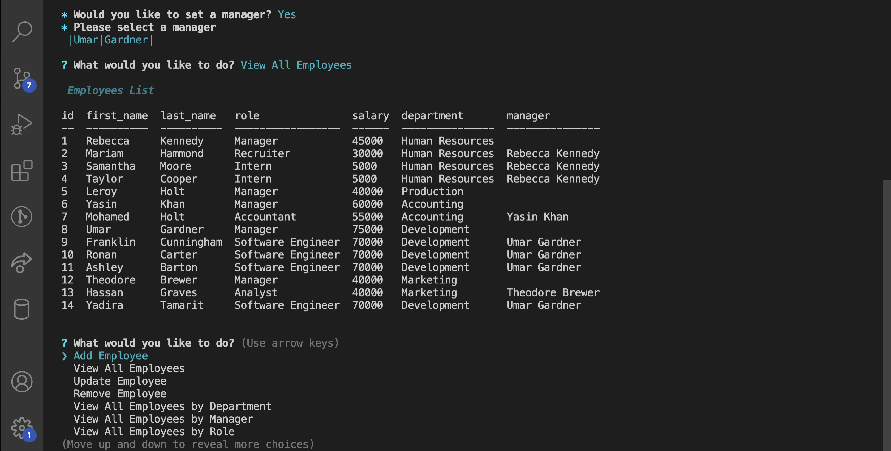
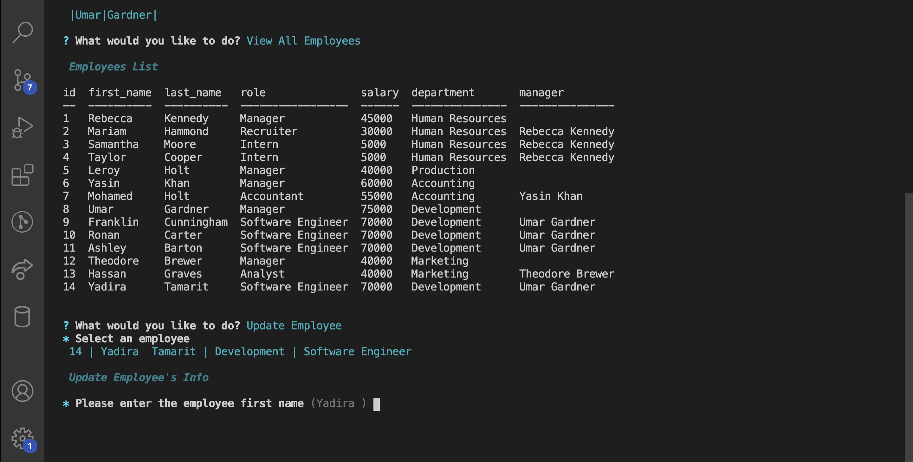
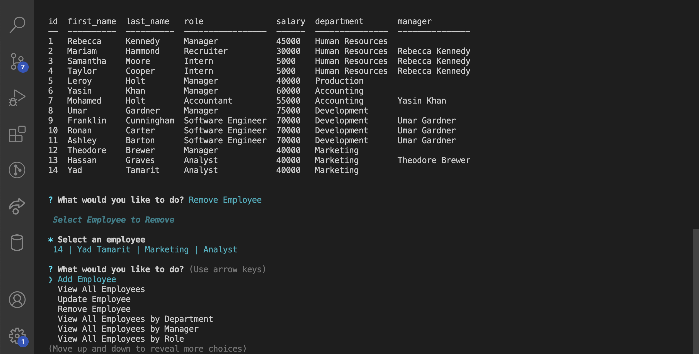

[](https://github.com/ystamaritq/employee-tracker/blob/master/LICENSE)


[](https://github.com/ystamaritq/employee-tracker/blob/master/LICENSE)


<div align="center">
<br>

<br>

> A solution for managing a company's employees using node, inquirer, and MySQL.
> <br>

</div>

---

## Table of Contents

- [Description](#description)
- [User Stories](#user-stories)
- [Installing / Getting Started](#installing-/-getting-started)
- [MVP](#mvp)
- [Demo](#demo)
- [Project Board](https://github.com/ystamaritq/employee-tracker)
- [Github Link](https://github.com/ystamaritq/employee-tracker)

---

## Description

A The command-line application for managing a company's employees using node, inquirer, and MySQL.

---

## User Stories

```
As a business owner
I want to be able to view and manage the departments, roles, and employees in my company
So that I can organize and plan my business
```

---

## Installing / Getting Started

To test this project, simply follow these steps:

```
step 1: clone https://github.com/ystamaritq/employee-tracker.git
step 2: install node https://nodejs.org/en/download/
step 3: npm install
step 4: node index.js

```

---

## Developing

#### Below is a summary of the key files for this project and their purpose:

- **index.js** main application entry point
- **package.json** - node package definition ()
- **assets** - files used by the readme
- **src/js** - js utilities used by the project
- **src/js/db** - db js files used by the project
- **src/js/models** - classes utilities (Department, Employee and Role) used by the project
- **src/js/prompts** - js prompts utilities used by the project
- **src/utils/** - common utilities used by the project
- **src/sql** - db utilities used by the project (schema.sql & seed.sql)

#### Dependecies used by the project


<details>
<summary>project files structure image</summary>

</details>

---

## MVP

    - Add Employee

    - View All Employees

    - Update Employee

    - Remove Employee

    - View All Employees by Department

    - View All Employees by Manager

    - View All Employees by Role

    - View Budget by Department

    - View All Managers

    - Add Role

    - View All Roles

    - Update Role

    - Remove Role

    - Add Department

    - View All Departments

    - Update Department

    - Remove Department

<details>
<summary>database schema image (MySQLWorkbench)</summary>

</details>

<details>
<summary>db images (MySQLWorkbench)</summary>


</details>

---

## Demo

#### The following video demonstrates the application functionality:

[Employee Tracker Link](https://drive.google.com/drive/folders/1qWR2TRJLYbwFE7C2rhiDDgvfqxLz2mnz?usp=sharing)

#### The following images demonstrates the application functionality:

<details>
<summary>employee tracker images</summary>









</details>

---

## Licensing

"The code in this project is licensed under MIT license."

---

**developed with love by **@ystamaritq\*\*\*\*

[Table of Contents](#table-of-contents)
